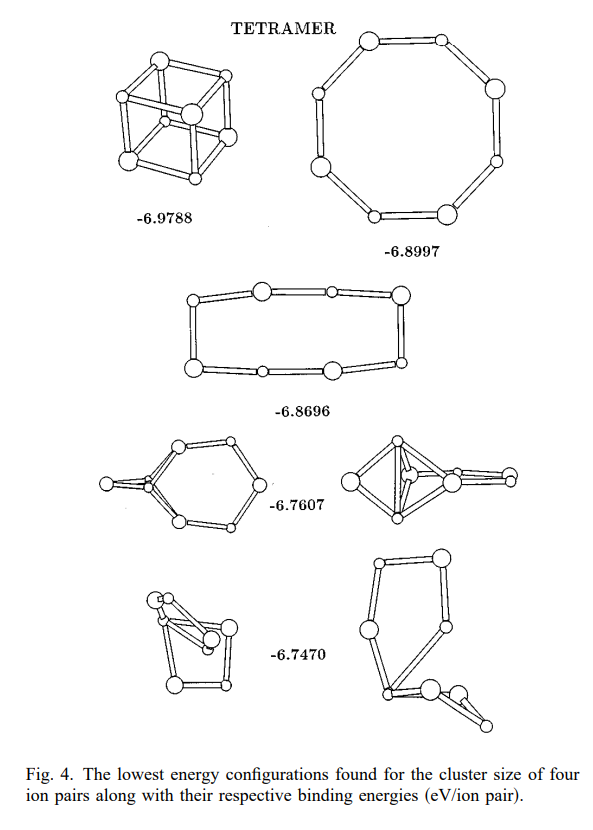
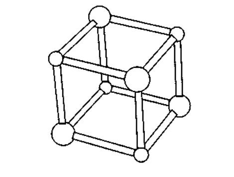
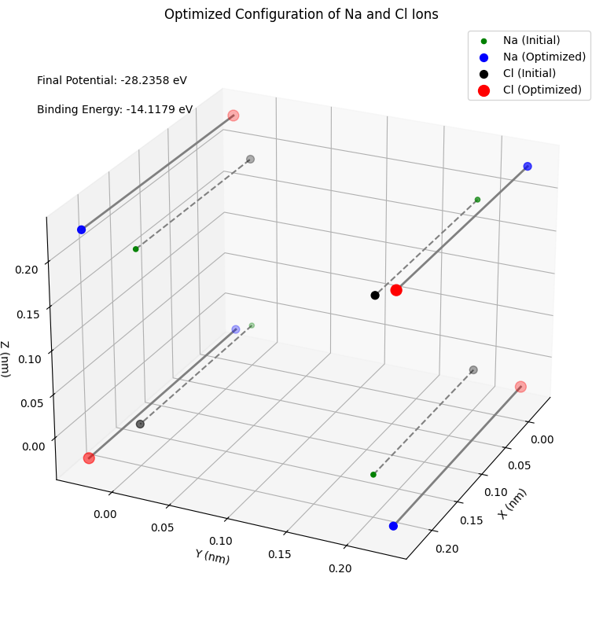
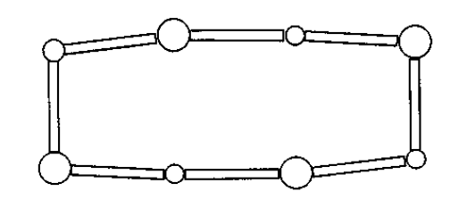
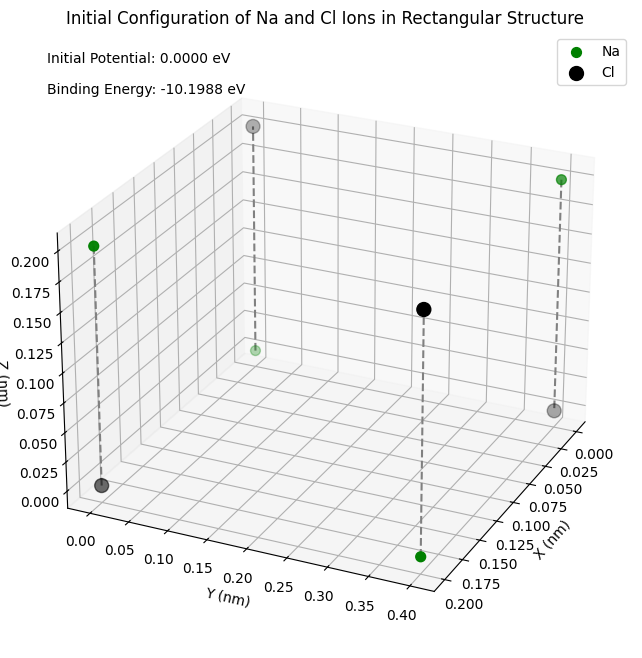
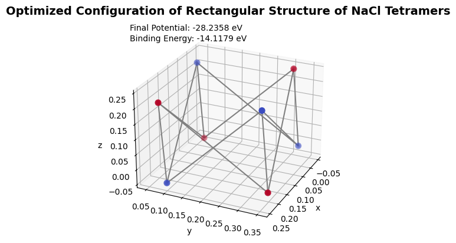
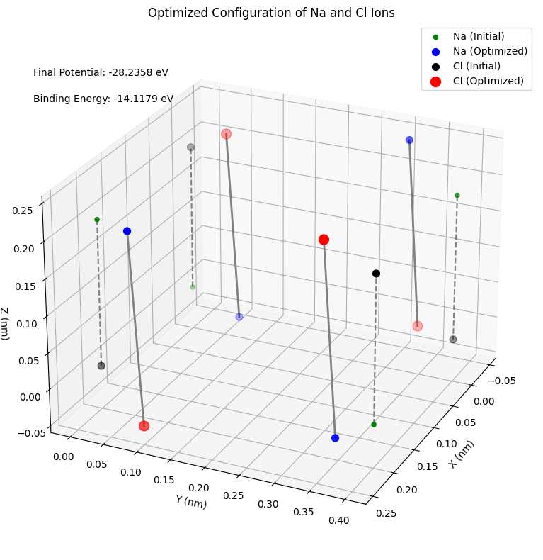
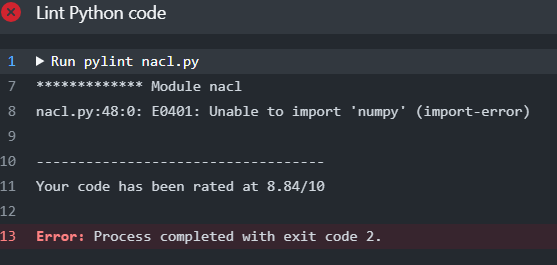
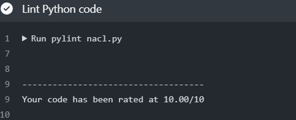

# Na₄Cl₄ Clusters Equilibrium Configurations


## Problem Overview

We are tasked with determining the equilibrium configurations of Na₄Cl₄ clusters for tetramers (n=4) based on [Figure 4](https://www.researchgate.net/figure/The-lowest-energy-configurations-found-for-the-cluster-size-of-four-ion-pairs-along-with_fig4_201976884) in the paper by [K. Michaelian](https://pubs.aip.org/aapt/ajp/article-abstract/66/3/231/1044856/Evolving-few-ion-clusters-of-Na-and-Cl?redirectedFrom=fulltext). The goal is to plot these configurations (2 congifugrations for each), label them with their energies, and initialize them to an "ideal" case for geometry, allowing optimization to find the final configurations.
 ## 7 configurations of Na₄Cl₄
 

## Approach for Each Case

### 1. Initialization

- **Ideal Geometry:** We start with an initial geometry configuration representing an "ideal" case for Na₄Cl₄ clusters.

### 2. Optimization

- **Code:** Utilize the code in [CompPhys/MinMax/nacl.ipynb](https://github.com/ubsuny/CompPhys/blob/main/MinMax/nacl.ipynb)for optimization.
- **Parameters:** Adjust optimization parameters as needed, considering convergence criteria.
- **Looping:** Implement a loop for optimization until convergence is achieved.

### 3. Plotting and Labeling

- **Code:** Modify the plotting code to include labels with corresponding energies.

# Briefly About K. Michaelian:
The ground state structures of Na and Cl few-ion clusters are discussed in this article. It describes the differences between the crystalline structure of bulk NaCl and the ground state configuration of these clusters. The use of a genetic algorithm to identify these clusters' lowest-energy configurations is also covered in this article. The binding energy and vibrational frequencies of these clusters are compared with published results from other simulations and with experimental data.

# Tetramers (n=4) Na₄Cl₄:
A tetramer of NaCl is a cluster of four sodium ions (Na+) and four chloride ions (Cl-) arranged in a tetrahedral shape. The tetramer is a stable configuration because the electrostatic interactions between the ions are minimized in this arrangement. The tetramer is also the smallest cluster of NaCl that can exhibit the same bulk properties as NaCl, such as the same lattice structure and the same melting point.

##  THE ION–ION POTENTIAL:
The two-body (Na and Cl) potential consists of the sum of the attractive or repulsive point charge Coulomb energy and the repulsive Pauli energy.


$$
U\left(r_{i j}\right)=\left\{\begin{array}{l}{-\frac{e^{2}}{4 \pi \epsilon_{0} r_{i j}}+\alpha e^{-r_{i j} / \rho}+b\left(\frac{c}{r_{i j}}\right)^{12}} (\mathrm{+ -})\\ {+\frac{e^{2}}{4 \pi \epsilon_{0} r_{i j}}+b\left(\frac{c}{r_{i j}}\right)^{12}} (\mathrm{++ or --}) \end{array}\right.
$$

where the Coulomb force has constant:

$$ke^2 = e^2/4\pi\epsilon_0 = 1.44\; \mathrm{eV-nm}$$

with Pauli exclusion term:

$$\alpha = 1.09e3\;\mathrm{eV}$$

and a term to stabilize (or "regularize") the computation at small distances with:

$$b = 1.0\;\mathrm{eV}$$

$$c = 0.01\;\mathrm{nm}$$

**Coulombic Term**: Describes the electrostatic interaction between charged particles. For (\(+ -\)), it's attractive, and for (\(++\) or \(--\)), it's repulsive.
**Pauli Exclusion Term**: Introduces a repulsive term based on the Pauli exclusion principle.

# Binding Energy:
 E_B = 1/2 * ∑_{i ≠ j} U_{ij}


**In the Paper. the r_eq = 52.312 Å, similar to the empirical value of 2.36 Å obtained from the rotational spectrum of NaCl vapor. I have chosen initial equilibrium position as a = 0.2 nm.**


# Configurations I Chose:
  
## 1. Cubic Structure:
  

  Initial Equlibrium positions of Na and Cl ions:
  ```python
  r_na = np.array( [ [ 0, 0, 0 ], [ a, a, 0 ], [ a, 0, a ], [ 0, a, a ] ]  )
r_cl = np.array( [ [ a, 0, 0 ], [ 0, a, 0 ], [ 0, 0, a ], [ a, a, a ] ] )
  ```
 ## Initial U and B.E. for Cubic Structure:
 ```python
initial U  : -16.037660834699643 eV

Binding Energy: -8.0188 eV
 ```
 

  ## Optimization:

The `scipy.optimize.minimize` function is used to optimize the configuration of a molecular cluster represented by the Cluster object.
The optimization is performed using the `BFGS` method (method="BFGS").
```python
res = scipy.optimize.minimize( fun=cluster, x0=vals_init, tol=1e-3, method="BFGS")
```
The initial values for the optimization are provided by vals_init.
**Update Cluster Positions:**
The optimized values obtained from the optimization (res.x) are set as the new positions of the Na and Cl ions in the Cluster object using the set_vals method. 
```python
Final optimized cluster positions
[[-0.03004317 -0.02999579 -0.03003077]
 [ 0.22998561  0.22999167 -0.03001431]
 [ 0.22997985 -0.03004831  0.2299622 ]
 [-0.03000754  0.22998193  0.23000898]
 [ 0.22996347 -0.03001732 -0.03004673]
 [-0.03002282  0.23001281 -0.0299997 ]
 [-0.03002801 -0.03002693  0.22997822]
 [ 0.23000068  0.22996054  0.22999278]]
Final potential: -28.23583056411562

Binding Energy: -14.1179 eV
```


## 2. Rectangular Structure:


Initial Equlibrium positions of Na and Cl ions:
```python
r_na = np.array( [ [ 0, 0, 0 ], [ a, 0, a ], [ 0, 2*a, a ], [ a,2*a, 0 ] ]  )
r_cl = np.array( [ [ 0, 0, a ], [ a, 0, 0 ], [ 0, 2*a, 0 ], [ a, 2*a, a ] ] )
```
## Initial U and B.E. for Cubic Structure:
 ```python
initial U  : -20.397511221729758 eV

Binding Energy: -10.1988 eV
 ```


## Optimization: 
I have followed the same process as in cubic structure.
```python
Final optimized cluster positions
[[-0.0136093   0.0643923  -0.0394076 ]
 [ 0.24510192  0.07803847  0.22153477]
 [-0.04453224  0.30399498  0.23779925]
 [ 0.21293086  0.35338138 -0.02004536]
 [-0.01298553  0.04652307  0.21998614]
 [ 0.24447768  0.09590667 -0.03785772]
 [-0.04515638  0.32186453 -0.02159475]
 [ 0.21355438  0.33551102  0.23934796]]
Final potential: -28.235830564338745

Binding Energy: -14.1179 eV
```




# GitHub Actions for Calculus.py: Linting

Code linting has been done using `pylint` and is automated with GitHub Actions. By doing this, we can make sure that the code is clear and error-free. For this, [linting_nacl.yml](https://github.com/ubsuny/23-Homework7G4/blob/main/.github/workflows/linting_nacl.yml) has been genrated and this works on the main python module  named [nacl.py](https://github.com/ubsuny/23-Homework7G4/blob/main/nacl.py). 
This module defines a computational model for a cluster of Na (sodium) and Cl (chlorine) ions.
The model uses a simplified potential energy model to describe the interactions between the ions
in the cluster. The primary purpose is to simulate and optimize the configuration of the ions
to find the minimum potential energy, representing a stable or equilibrium state.

The first pylint suggestions are as follows:



**Well, there were multiple indentions, line too long, unused imports, standard snake case naming convention and Capitalize contsants kind of issues suggested to be fixed by pylint which are addressed before in the woking environment.The import numpy has been sorted out and the resulting linted and 10/10 pylint rated code is:**

```python
"""
nacl.py - Computational Model for Na-Cl Ionic Cluster

This module defines a computational model for a cluster of Na (sodium) and Cl (chlorine) ions.
The model uses a simplified potential energy model to describe the interactions between the ions
in the cluster. The primary purpose is to simulate and optimize the configuration of the ions
to find the minimum potential energy, representing a stable or equilibrium state.

Constants:
- KE2: Coulomb force charge in electron-volts times nanometers.
- ALPHA, RHO, B, C: Parameters of the model.

Functions:
- cp(l): Generate combinations of pairs from a list.

Class:
- Cluster: Represents a cluster of Na and Cl ions.
    Attributes:
        - positions: Concatenated positions of Na and Cl ions.
        - charges: Concatenated charges of Na and Cl ions.
        - combs: Combinations of pairs of ion indices.
        - chargeprods: Product of charges for each ion pair.
        - rij: Distances between ion pairs.
    Methods:
        - calculate_potentials(): Calculate potentials between ion pairs.
        - calculate_total_potential(): Calculate the total potential energy.
        - calculate_binding_energy(): Calculate the binding energy.
        - get_flattened_positions(): Get flattened positions.
        - set_positions_from_flattened(vals): Set positions from flattened input.
        - __call__(vals): Function that scipy.optimize.minimize will call.

Usage:
- The module is used to create an instance of the Cluster class, define the initial positions
  of Na and Cl ions, and optimize the configuration to minimize the potential energy.

Example:
- The module includes an example where the initial configuration of Na and Cl ions is visualized
  in a 3D plot. 
  The scipy.optimize.minimize function is then used to find the optimized configuration,
  and the final positions and potential energy are printed.

This library serves as a computational tool for exploring the behavior of a simplified 
ionic cluster system, particularly focusing on the optimization of ion positions to achieve 
a stable configuration with minimal potential energy.
"""
# Have adjusted Uij to uij to follow sbakecase sugeested by pylint

# pylint: disable=E0401
import itertools
import numpy as np
#import matplotlib.pyplot as plt
#from mpl_toolkits.mplot3d import Axes3D
#import scipy.optimize


# Constants
KE2 = 197 / 137  # eV-nm   Coulomb force charge
ALPHA = 1.09e3  # eV      parameter of model
RHO = 0.0321    # nm      parameter of model
B = 1.0         # eV      regular
C = 0.01        # nm


def cp(l):
    """
    Generate combinations of pairs from a list.

    Parameters:
    - l (list): List of values.

    Returns:
    - numpy.ndarray: Array containing all combinations of pairs from the list.
    """
    return np.fromiter(itertools.chain(*itertools.combinations(l, 2)), dtype=int).reshape(-1, 2)


class Cluster:
    """
    Class representing a cluster of Na and Cl ions.
    """

    def __init__(self, r_na, r_cl):
        '''
        Initialize the Cluster.

        Parameters:
        - r_na (numpy.ndarray): Positions of Na ions.
        - r_cl (numpy.ndarray): Positions of Cl ions.
        '''
        self.positions = np.concatenate((r_na, r_cl))
        self.charges = np.concatenate([np.ones(r_na.shape[0]), np.full(r_cl.shape[0], -1)])
        self.combs = cp(np.arange(self.charges.size))
        self.chargeprods = self.charges[self.combs][:, 0] * self.charges[self.combs][:, 1]
        self.rij = np.linalg.norm(
    self.positions[self.combs][:, 0] - self.positions[self.combs][:, 1],
    axis=1
)

        self.uij_values = None  # Initialize Uij values to None

    def calculate_potentials(self):
        '''
        Calculate potentials between ion pairs.

        Returns:
        - numpy.ndarray: Vector of potentials for all combinations.
        '''
        uij = np.zeros_like(self.rij)
        pos = self.chargeprods > 0
        neg = ~pos
        uij[pos] = KE2 / self.rij[pos] + B * (C / self.rij[pos]) ** 12
        uij[neg] = (
    -KE2 / self.rij[neg]
    + ALPHA * np.exp(-self.rij[neg] / RHO)
    + B * (C / self.rij[neg]) ** 12
)

        self.uij_values = uij  # store Uij values
        return uij

    def calculate_total_potential(self):
        '''
        Calculate the total potential energy.

        Returns:
        - float: Total potential energy.
        '''
        if self.uij_values is None:
            self.calculate_potentials()
        return np.sum(self.uij_values)

    def calculate_binding_energy(self):
        '''
        Calculate the binding energy.

        Returns:
        - float: Binding energy.
        '''
        if self.uij_values is None:
            self.calculate_potentials()
        binding_energy = 0.5 * np.sum(self.uij_values)
        return binding_energy

    def get_flattened_positions(self):
        '''
        Get flattened positions.

        Returns:
        - numpy.ndarray: Flattened positions.
        '''
        return np.reshape(self.positions, -1)

    def set_positions_from_flattened(self, vals):
        '''
        Set positions from flattened input.

        Parameters:
        - vals (numpy.ndarray): Flattened positions.
        '''
        self.positions = vals.reshape(self.positions.shape)
        self.rij = np.linalg.norm(
    self.positions[self.combs][:, 0] - self.positions[self.combs][:, 1],
    axis=1
)

        self.uij_values = None  # Reset Uij values

    def __call__(self, vals):
        '''
        Function that scipy.optimize.minimize will call.

        Parameters:
        - vals (numpy.ndarray): Flattened positions.

        Returns:
        - float: Potential energy.
        '''
        self.set_positions_from_flattened(vals)
        return self.calculate_total_potential()
```


**The main module has been linted, but for better visualization I have created separate files in jupyter notebook formats namely [cubic_nacl.ipynb](https://github.com/ubsuny/23-Homework7G4/blob/main/cubic_nacl.ipynb) and [rectangular_nacl.ipynb](https://github.com/ubsuny/23-Homework7G4/blob/main/rectangular_nacl.ipynb) and they have their own functions defined.** 


# Bibliography:
- ["Evolving Few-Ion Clusters of Na and Cl" by K. Michaelian](https://pubs.aip.org/aapt/ajp/article-abstract/66/3/231/1044856/Evolving-few-ion-clusters-of-Na-and-Cl?redirectedFrom=fulltext)
- [CompPhys/MinMax/nacl.ipynb](https://github.com/ubsuny/CompPhys/blob/main/MinMax/nacl.ipynb)
- [Structure and dynamics in clusters ](https://web.archive.org/web/20100612212925id_/http://berrygroup.uchicago.edu/papers/302a.pdf)
- [Sodium Chloride | Formula & Structure](https://study.com/learn/lesson/sodium-chloride.html)
- [Tetramers wikipedia](https://en.wikipedia.org/wiki/Tetramer)


